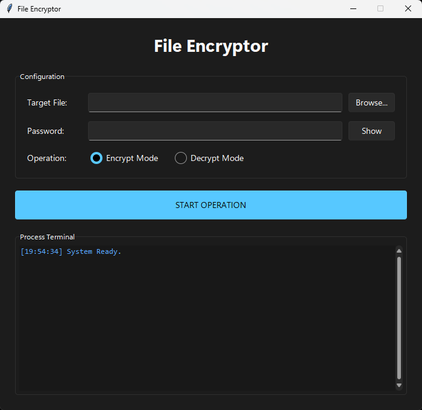

# 🔒 Secure File Cryptor


A modern, fast, and secure file encryption utility built with **Python** and **Tkinter**. 
It features a sleek Windows 11-style dark theme (via `sv-ttk`) and uses **AES-256-GCM** authenticated encryption to ensure your files remain private and tamper-proof.


*(Add a screenshot of your app here named screenshot.png)*

## ✨ Features

*   **Modern UI:** Clean dark theme using the Sun Valley `sv-ttk` library.
*   **Strong Encryption:** Uses AES-256-GCM (Galois/Counter Mode).
*   **Authenticated Decryption:** Verifies data integrity. If a file is corrupted or tampered with, it refuses to decrypt.
*   **Secure Key Derivation:** Uses PBKDF2-HMAC-SHA256 with 600,000 iterations and a unique salt per file.
*   **Non-Blocking:** Runs operations in a separate thread so the GUI never freezes.
*   **Process Terminal:** Live log output showing exactly what is happening (key derivation, chunk processing, verification).

## 🛠️ Installation

1.  **Clone the repository:**
    ```bash
    git clone https://github.com/yourusername/secure-file-cryptor.git
    cd secure-file-cryptor
    ```

2.  **Install dependencies:**
    ```bash
    pip install sv-ttk cryptography
    ```

3.  **Run the application:**
    ```bash
    python encryptor.py
    ```

## 🔐 Security Details

This application is not just a UI wrapper; it implements standard cryptographic best practices:

*   **Algorithm:** AES (Advanced Encryption Standard).
*   **Mode:** GCM (Galois/Counter Mode) - Provides both confidentiality and integrity.
*   **Key Derivation:** PBKDF2HMAC (SHA-256) transforms your password into a 32-byte key using a random 16-byte salt and 600,000 iterations.
*   **Structure:**
    `[Salt (16 bytes)] + [Nonce (12 bytes)] + [Ciphertext] + [Auth Tag (16 bytes)]`

## 📦 Building an EXE

To convert this script into a standalone Windows executable, use **PyInstaller**. 

**Note:** You must use `--collect-all sv_ttk` to include the theme files.

```powershell
pip install pyinstaller
pyinstaller --noconsole --onefile --collect-all sv_ttk --icon=icon.ico encryptor.py
```

## ⚠️ Disclaimer

This tool is provided for educational and personal use. While it uses industry-standard libraries (`cryptography`), always keep a backup of your important files before encryption. If you lose your password, **there is no recovery method**.

## 📄 License

This project is open source and available under the [MIT License](LICENSE).
